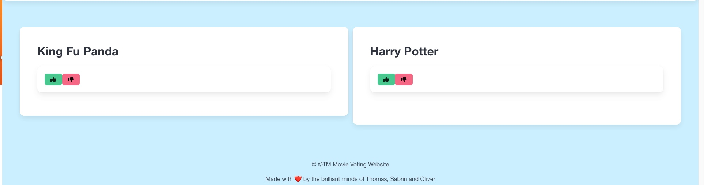
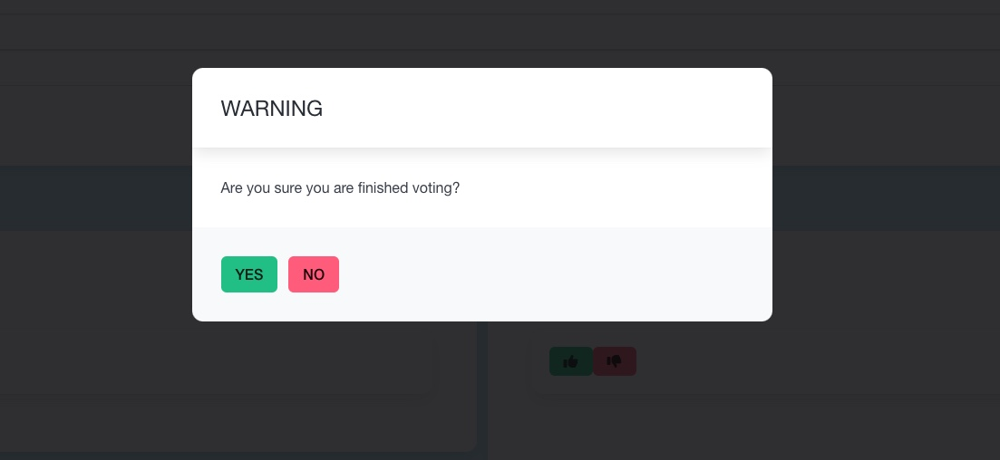
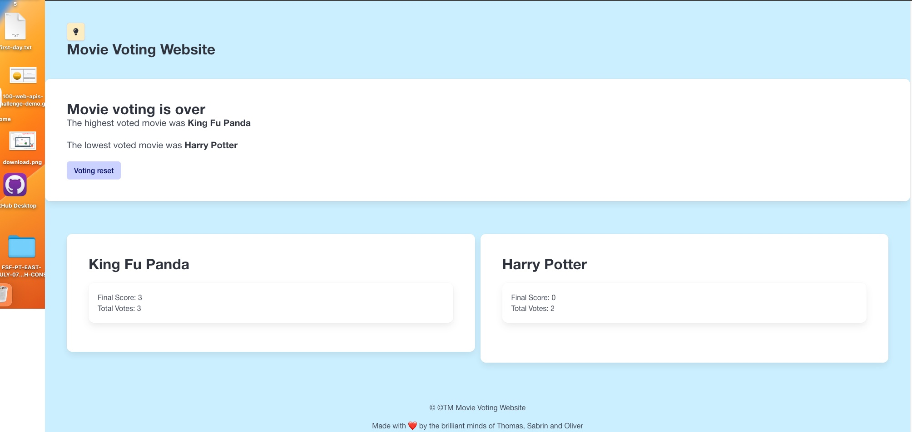

# Movie Voting Website/Movte

## Description 
Have you ever been at a movie night with friends where you ended up leaving and not watching a movie because your friends couldnt agree on a movie?

Our movie voting app is a fun tool to use with friends and family. Our app takes everyones choice into consideration while also using metrics to decide between for example: Barbie the movie or Captain America.

Our interactive website allows the user to suggest a movie, vote on a movie and tally up the votes.

## User Story:
```md
As a host i want to be able to either take suggestions or make suggestions on movie night.
I want to allow guests to vote on suggested movie titles.
i want a modal to appear when i click finish voting that asks me to confirm whether or not i would like to "finish voting."
I want to be able to see the winning movie/ lowest voted movies(s).
I also want a dark/light mode button.
```
## Visual Representation






## Credits 🏆 
 - Oliver Bauvil: https://github.com/Olivebolt

 - Thomas Stemler: https://github.com/OccultParrot

 - Sabrin Othman: https://github.com/sabrinothman6495?tab=repositories


## License 
[LICENSE.md](https://github.com/OccultParrot/movie-suggestion-voting/blob/main/LICENSE)


## Features

Site has dark and light mode feature. 
Site is interactive, we use forms and modals to interact with our user.